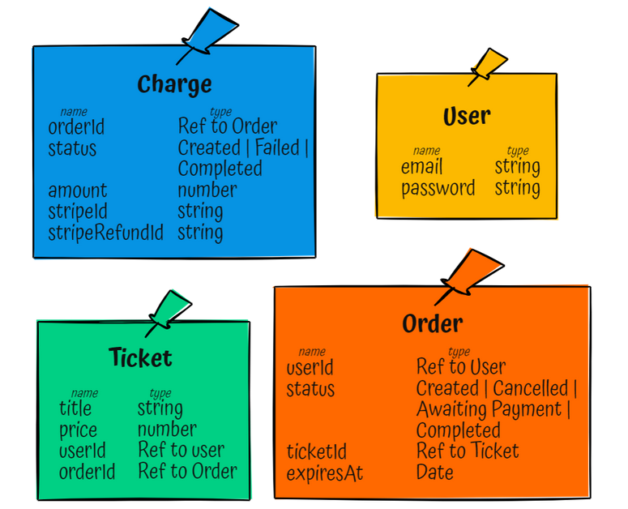

# Ticketing

This app is my version of the excellent course from Stephen Grider _Microservices with NodeJS and React_ on udemy. (https://www.udemy.com/course/microservices-with-node-js-and-react)

Note: Last tested on Windows 10 (August 2022)

## Requirements

- node v.
- npm v.
- docker desktop v.
- skaffold cli v.
-

## Before running cluster

`npm install`

### Note: you must initialize secrets in your cluster, here I use kubectl from-literal but any way you prefer should work

`kubectl create secret generic jwt-secret --from-literal=JWT_KEY=[THE KEY]`

`kubectl create secret generic stripe-secret --from-literal=STRIPE_KEY=[THE KEY]`

`kubectl create secret generic stripe-public --from-literal=STRIPE_PUBLISHABLE=[THE KEY]`

You can get your stripe secret key and publishable key in API Keys in the Developers section of your stripe account. (Using secrets for something not secret could probably be improved)

## you also need to install ingress-nginx on your cluster

`kubectl apply -f https://raw.githubusercontent.com/kubernetes/ingress-nginx/controller-v1.3.0/deploy/static/provider/cloud/deploy.yaml`

## Running cluster

`skaffold dev`

this might take quite a long time and you might have to restart the process a few time as docker desktop is not 100%...

# Quick overview of the architecture

## Datatypes used by the different services

## Events that will be sent between services

# Dev Tips

1. To debug this locally using chrome you'll have to bypass security for the weird nginx configs will not allow us to _normally_ bypass this by exporting and importing the fake certificate. The way to go is, in Chrome, in the tab you're loading type this: `thisisunsafe`
